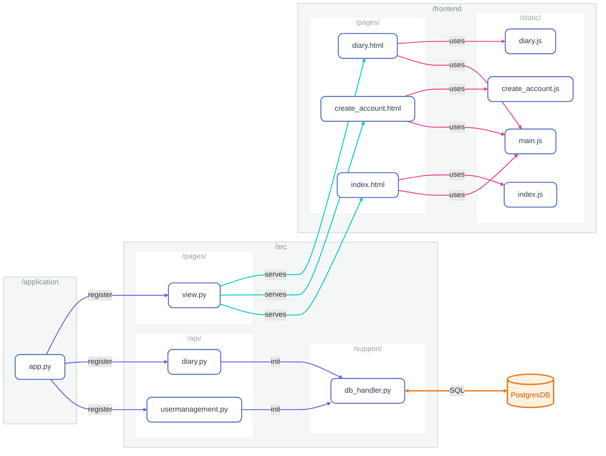

# Intro

 This project is used for the SIVS course at the University of Applied Sciences Burgenland.

Students will attempt to secure a web server and identify security vulnerabilities. 
This application is intentionally insecure and is used as a learning project to help students identify and fix vulnerabilities.

Vulnerabilities included:
XSS, SQLi, missing access control and misconfiguration of the web server.
 

# How to install on Server (AWS Learner Lab)

1. Connect to your server (Ubuntu Instance)
2. Run following commands

```bash
mkdir -p /home/ubuntu/
rm -rf /home/ubuntu/sivs-diary
cd /home/ubuntu/
git clone https://github.com/fhtevssivs/sivs-diary.git
cd sivs-diary/sivs-diary/install/
sudo chmod +x ./install.sh 
sudo ./install.sh
```

# How to run on your local Machine

1. Go to install folder
2. Run `sudo docker compose --env-file ../.env up -d`
3. Setup Python environment and install dependencies from "requirements.txt"
4. Run `python3 create_db.py`

# Overview Python and JS Components


